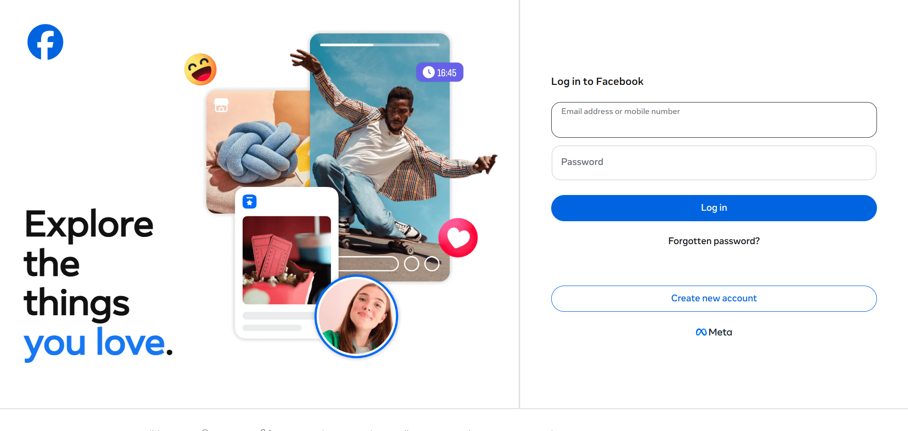

# Facebook Login Page Clone

A clean, responsive clone of the Facebook login page built using only **HTML** and **CSS**. This project was created as a hands-on exercise to practice layout design, form styling, and responsive web development.

  

---

## 🚀 Live Demo

Check out the live version hosted on GitHub Pages:

👉 **[View the live page](https://sadahamvishwanath.github.io/Facebook_Login/login.html)**

---

## ✨ Features

- **Two-column layout** – Facebook brand messaging on the left, login card on the right.
- **Fully responsive** – Adapts seamlessly to mobile, tablet, and desktop screens.
- **Realistic UI** – Matches the official Facebook login design, including:
  - Email and password input fields with focus effects.
  - Login button with hover animation.
  - "Forgotten password?" link.
  - "Create new account" button.
  - Meta branding footer.
- **External CSS** – Clean separation of structure (HTML) and styling (CSS) for maintainable code.

---

## 🛠️ Technologies Used

- **HTML5** – Semantic markup for the page structure.
- **CSS3** – Flexbox, media queries, transitions, and custom styling.
- **Git & GitHub** – Version control and deployment via GitHub Pages.

---

## 📁 Project Structure
```
[your-repo-name]/
│
├── index.html # Main HTML file
├── style.css # All styles (external)
├── README.md # Project documentation (this file)
└── Screenshot.png # (Optional) Screenshot of the page

```


---

## 🧠 What I Learned

Building this project helped me practice:

- Structuring a login page with semantic HTML.
- Using **Flexbox** to align and distribute elements.
- Creating a **responsive design** with CSS media queries.
- Styling form inputs, buttons, and links for a polished user experience.
- Deploying a static site to **GitHub Pages**.

---

## 📦 How to Run Locally

1. **Clone the repository**:
   ```bash
   git clone https://github.com/[your-username]/[your-repo-name].git
Navigate into the project folder:

bash
cd [your-repo-name]
Open index.html in your browser:

Double-click the file, OR

Use VS Code's Live Server extension for a better development experience.

🔮 Future Improvements
Add JavaScript validation for email and password fields.

Implement a "Show/Hide Password" toggle.

Create a fully functional "Create new account" modal popup.

Connect to a backend (Node.js/PHP) for real authentication.

📝 Credits
Built from scratch as part of a personal learning journey. The design is inspired by the official Facebook login page.

📄 License
This project is for educational purposes only. All rights to the original Facebook design belong to Meta Platforms, Inc.

text

---

